<h1 align="center"> Cadê meu Pet? </h1>

Desenvolvimento de um Website para Localização e Adoção de animais perdidos.

Projeto entregue ao curso EAD de Bacharelado em Engenharia de Software como pré-requisito obrigatório à obtenção do título de Bacharel em Engenharia de Software.

  <a href="#-tecnologias">Tecnologias</a>&nbsp;&nbsp;&nbsp;|&nbsp;&nbsp;&nbsp;
  <a href="#-projeto">Projeto</a>&nbsp;&nbsp;&nbsp;|&nbsp;&nbsp;&nbsp;
  <a href="#-diagramas">Diagramas</a>&nbsp;&nbsp;&nbsp;|&nbsp;&nbsp;&nbsp;
  <a href="#-layout">Layout</a>&nbsp;&nbsp;&nbsp;

 

  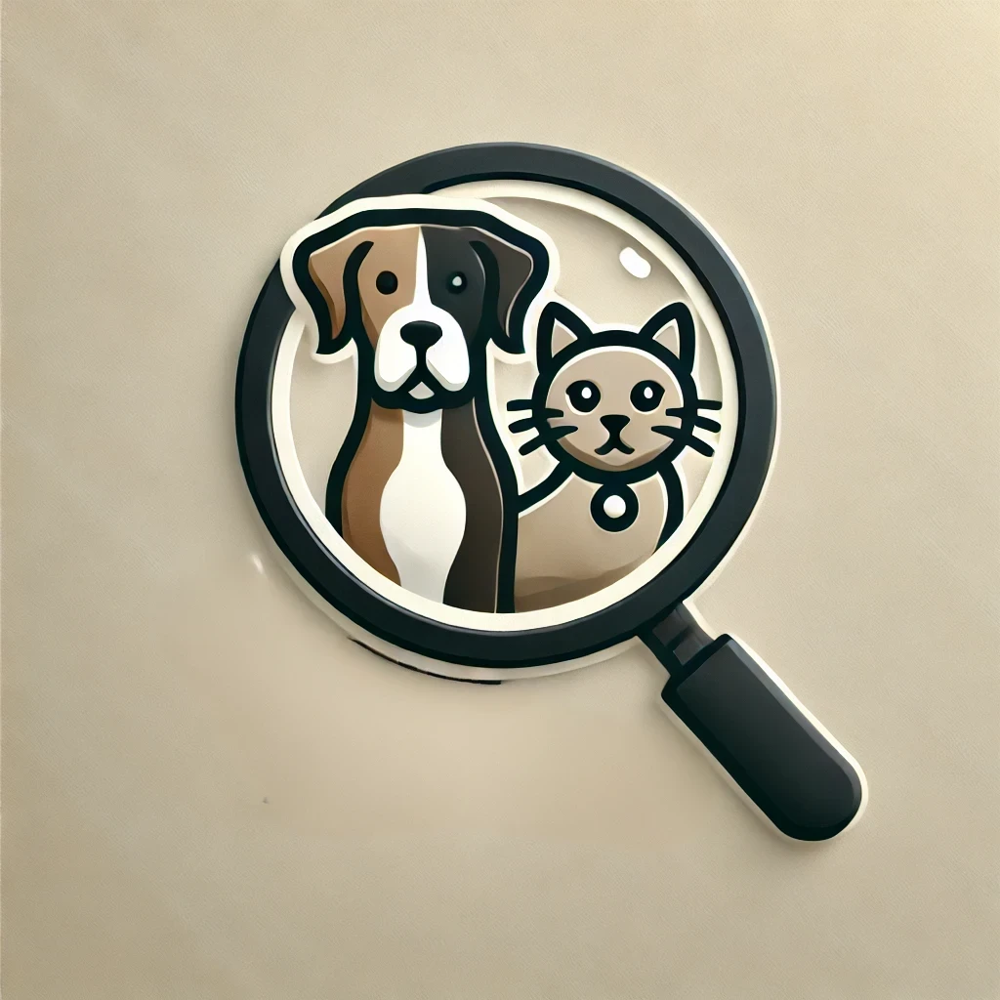

## 🚀 Tecnologias

Esse projeto foi desenvolvido com as seguintes tecnologias:

- Node.js
- Express.js
- EJS
- SQL Server
- HTML
- CSS
- JavaScript
- Bootstrap
- Google Maps API
- Git e Github
- FDD

## 💻 Projeto

Cadê Meu Pet? é uma plataforma web desenvolvida para ajudar na localização, resgate e adoção de animais perdidos ou encontrados, facilitando a conexão entre tutores e adotantes. O site oferece uma solução prática e acessível para gerenciar cadastros de animais, proporcionando uma interface amigável onde usuários podem buscar, visualizar e gerenciar informações sobre animais. Os responsáveis podem cadastrar animais desaparecidos, encontrados ou disponíveis para adoção e informar suas localizações através de uma integração com API de geolocalização, que facilita a visualização de onde o animal foi visto pela última vez.

O projeto nasceu da necessidade crescente de recursos que aproximem tutores e adotantes de forma eficiente, promovendo a responsabilidade social e incentivando a adoção responsável. Ele oferece funcionalidades intuitivas para navegação, busca, e contato direto com os responsáveis pelos animais através da integração com o WhatsApp, além de permitir o gerenciamento completo de cadastros para os usuários.

## 📊 Diagramas
<h3 align="center"> Classes </h3>

  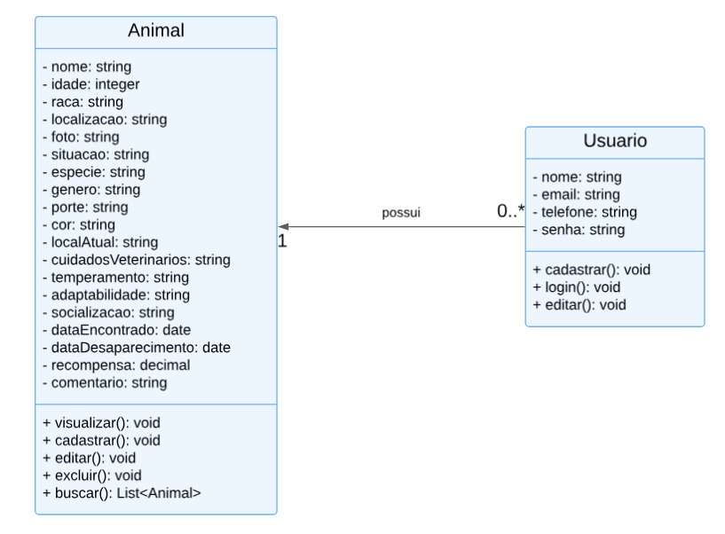

<h3 align="center"> Caso de Uso </h3>

  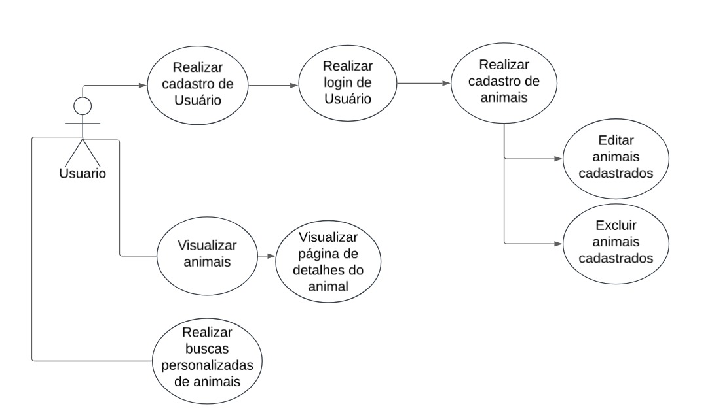

<h3 align="center"> Sequência </h3>

  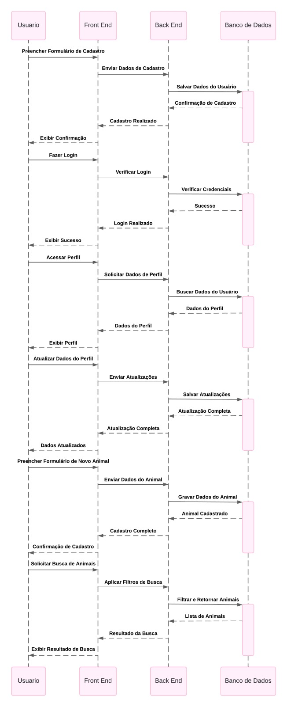

## 🔖 Layout

<h3 align="center"> Início </h3>

  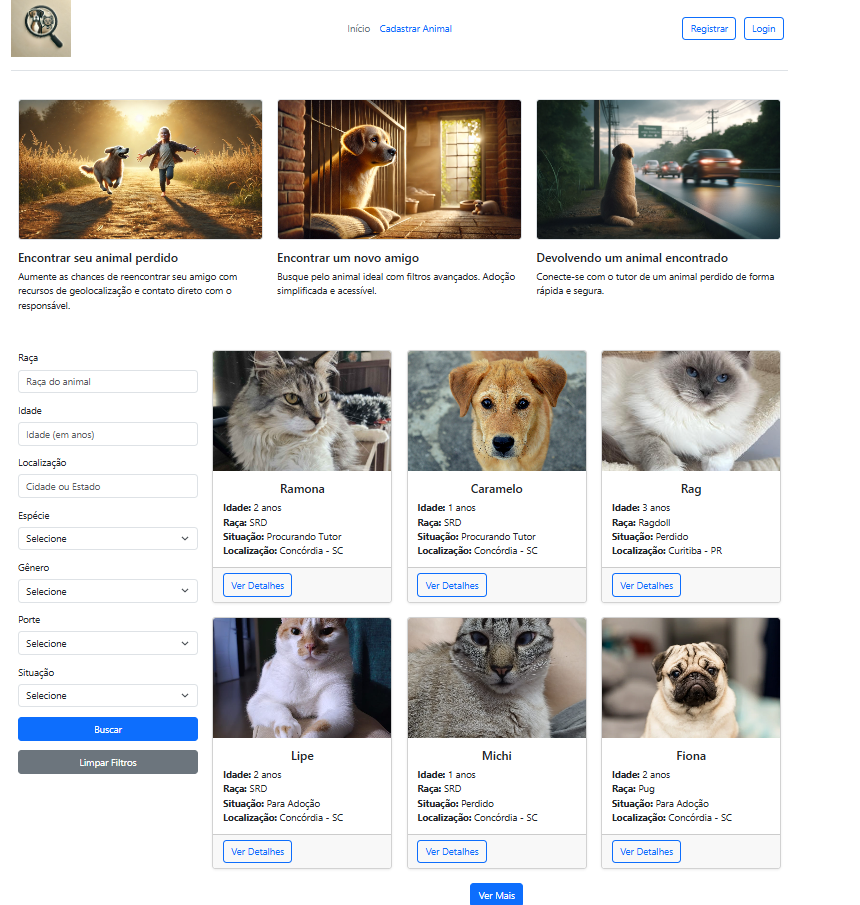

<h3 align="center"> Registrar Usuário </h3>

  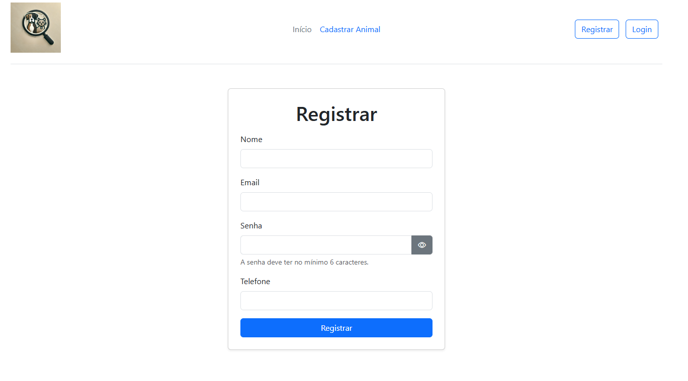

<h3 align="center"> Login </h3>

  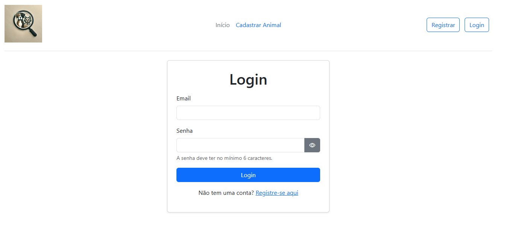

<h3 align="center"> Perfil </h3>

  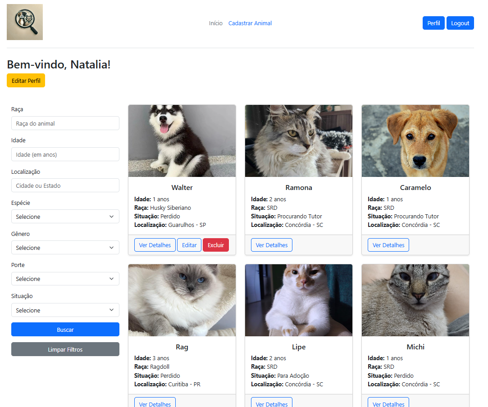

<h3 align="center"> Cadastro de Animal - Adoção  </h3>

  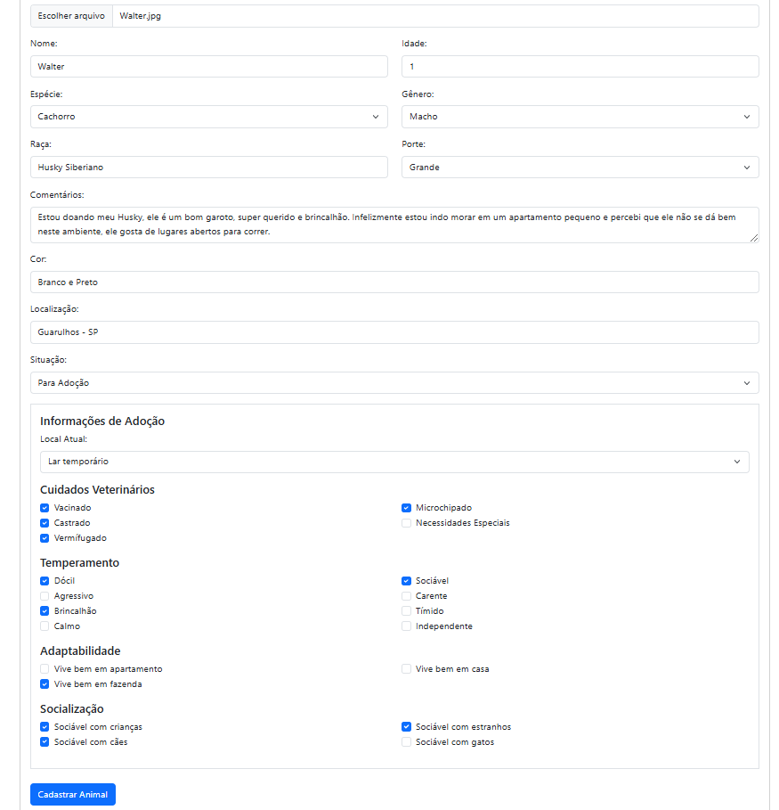

<h3 align="center"> Cadastro de Animal - Perdido </h3>

  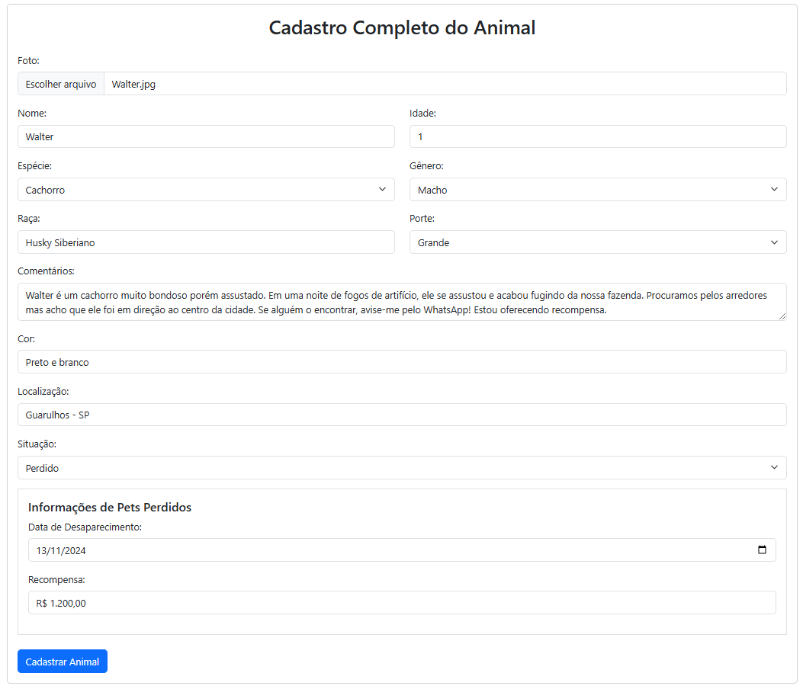

<h3 align="center"> Edição de Animal - Procurando Tutor </h3>

  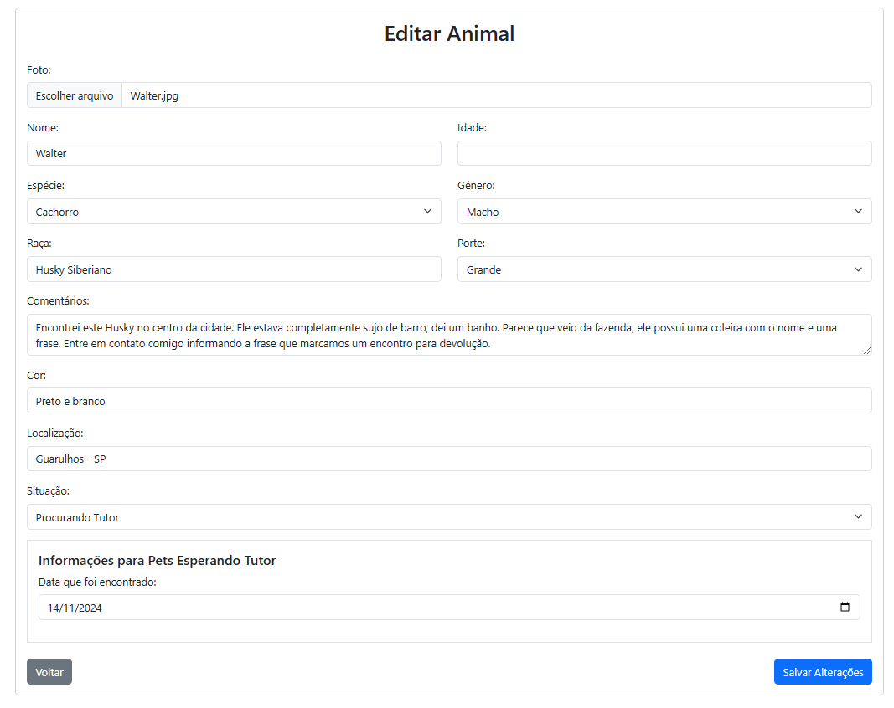

<h3 align="center"> Detalhes do Animal </h3>

  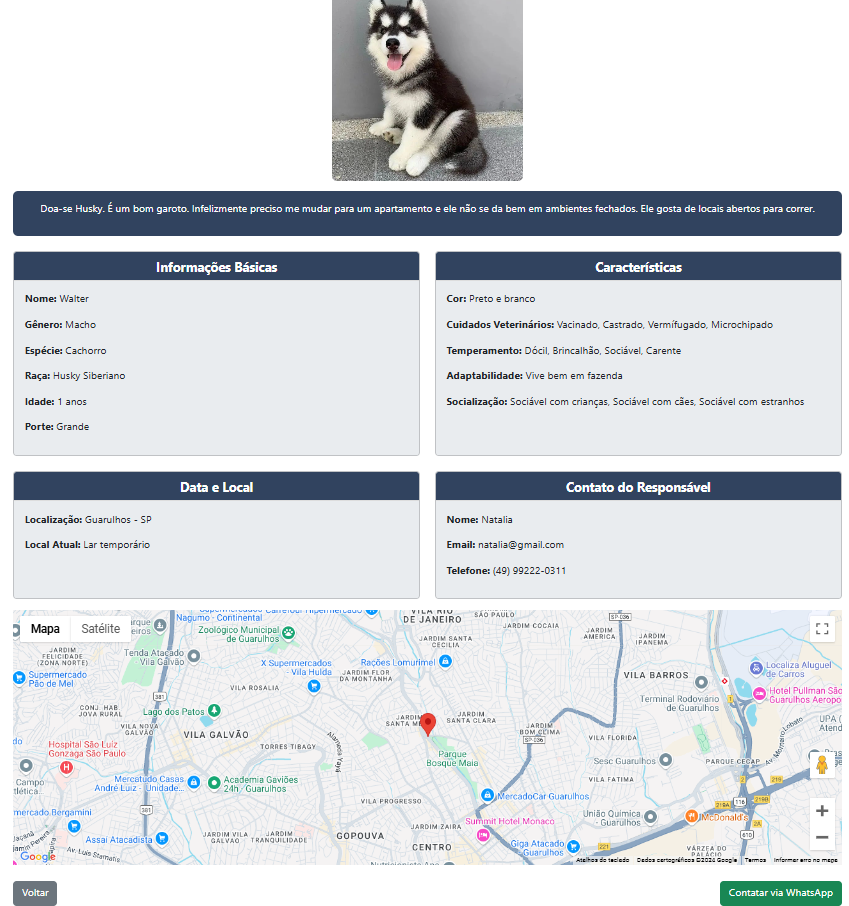

---

Feito com ❤️ por Natalia Ruchs
